# 🚀 KETOAN ERP — Hệ Thống Kế Toán Doanh Nghiệp Thế Hệ Mới

<p align="center">
  
  
  
  
  
  
</p>

<p align="center">
  <i>Hệ thống hoạch định nguồn lực doanh nghiệp (ERP) tích hợp AI — Tự động hóa kế toán, thông minh hóa quản trị</i>
</p>

<p align="center">
  <b>Tuân thủ:</b> Thông tư 200/2014/TT-BTC · Thông tư 99/2025/TT-BTC · NĐ 48/2024/NĐ-CP · NĐ 254/2026/NĐ-CP
</p>

---

## 📋 Mục lục

- [✨ Tổng quan](#-tổng-quan)
- [🏗️ Kiến trúc Hệ thống](#️-kiến-trúc-hệ-thống)
- [🛠️ Công nghệ Sử dụng (Tech Stack)](#️-công-nghệ-sử-dụng-tech-stack)
- [🎯 Tính năng Chính](#-tính-năng-chính)
- [🧠 AI & Machine Learning](#-ai--machine-learning)
- [🏛️ Kiến trúc Phần mềm (Software Architecture)](#️-kiến-trúc-phần-mềm-software-architecture)
- [🔒 Bảo mật Đa tầng (Multi-Layer Security)](#-bảo-mật-đa-tầng-multi-layer-security)
- [📊 Database Schema & Performance](#-database-schema--performance)
- [⚡ Hiệu năng & Scale](#-hiệu-năng--scale)
- [🧪 Testing & Quality Assurance](#-testing--quality-assurance)
- [🚀 Deployment & CI/CD](#-deployment--cicd)
- [📚 API Documentation](#-api-documentation)
- [🖥️ Giao diện Người dùng](#️-giao-diện-người-dùng)
- [🔌 Tích hợp & Interoperability](#-tích-hợp--interoperability)
- [📦 Cài đặt Nhanh](#-cài-đặt-nhanh)
- [👥 Đội ngũ & Đóng góp](#-đội-ngũ--đóng-góp)

---

## ✨ Tổng quan

**KETOAN ERP** là một hệ thống hoạch định nguồn lực doanh nghiệp (ERP) mã nguồn mở, tập trung vào kế toán kép theo chuẩn mực Việt Nam, được xây dựng với kiến trúc hiện đại và tích hợp trí tuệ nhân tạo ở cốt lõi.

### 🎯 Bài toán giải quyết

| Vấn đề | Giải pháp | Tác động |
|--------|-----------|----------|
| Nhập liệu kế toán thủ công tốn thời gian | AI OCR + Tự động phân loại chứng từ | ⏱️ Giảm 70% thời gian |
| Sai sót trong hạch toán | AI gợi ý hạch toán + Validation tự động | ✅ Tăng 30% độ chính xác |
| Khóa sổ cuối kỳ phức tạp | Workflow AI tự động kiểm tra & kết chuyển | 📉 Giảm 50% thời gian |
| Thiếu thông tin tài chính realtime | AI Copilot hỏi đáp bằng tiếng Việt tự nhiên | 📊 Ra quyết định nhanh hơn |
| Chi phí phần mềm kế toán cao | SaaS với chi phí thấp, mã nguồn mở | 💰 Tiết kiệm 40% |

### 👥 Đối tượng người dùng

| Vai trò | Quyền hạn | Module chính |
|---------|-----------|--------------|
| **admin** | Toàn quyền hệ thống | Quản trị, Audit, Cấu hình |
| **ktt** (Kế toán trưởng) | Phê duyệt, khóa sổ | Duyệt chứng từ, Báo cáo |
| **nv** (Nhân viên kế toán) | Nhập liệu, hạch toán | Chứng từ, Sổ sách, Công nợ |
| **nv_banhang** | Bán hàng, POS | Storefront, Đơn hàng |
| **nv_kho** | Nhập/xuất kho | Kiểm kê, Tồn kho |
| **gd_kinhdoanh** | Dashboard, Báo cáo | Doanh thu, KPI |

---

## 🏗️ Kiến trúc Hệ thống

### Kiến trúc Tổng thể (Hybrid Microservices)

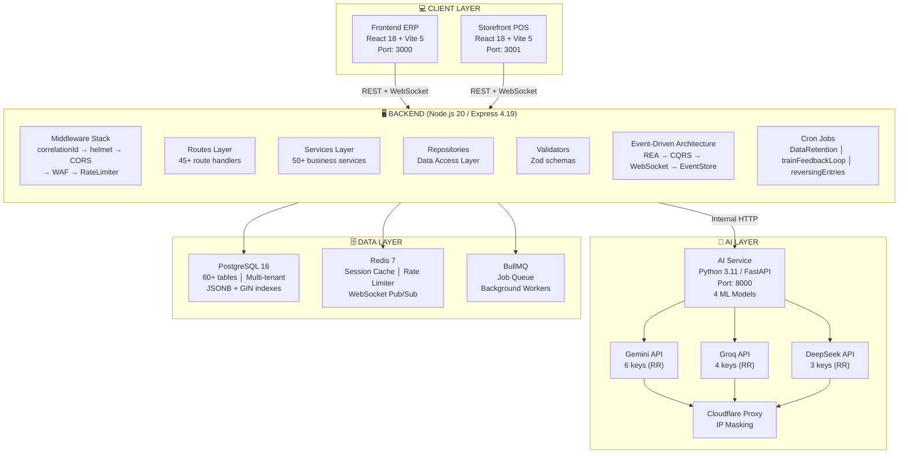

### Kiến trúc AI Multi-Provider

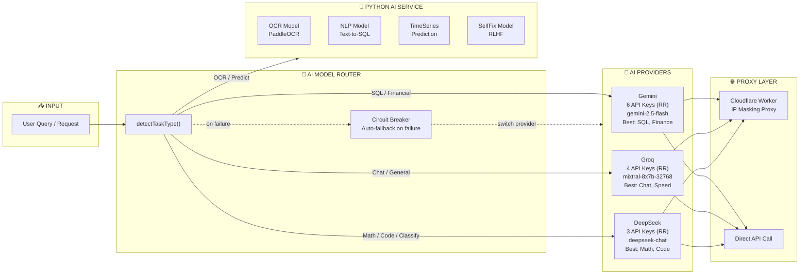

---

## 🛠️ Công nghệ Sử dụng (Tech Stack)

### Backend Core

| Công nghệ | Version | Mục đích |
|-----------|---------|----------|
| **Node.js** | ≥ 18.0.0 | Runtime (ES Modules) |
| **Express** | 4.19.2 | Web framework |
| **pg** | 8.11.5 | PostgreSQL native driver |
| **ioredis** | 5.11.1 | Redis client |
| **BullMQ** | 4.18.3 | Job queue & background workers |
| **Socket.io** | 4.8.3 | WebSocket real-time communication |
| **Socket.io Redis Adapter** | 8.3.0 | Multi-instance WebSocket scaling |
| **jsonwebtoken** | 9.0.2 | JWT authentication |
| **bcryptjs** | 2.4.3 | Password hashing |
| **zod** | 4.4.3 | Runtime schema validation |
| **helmet** | 8.3.0 | HTTP security headers |
| **cors** | 2.8.5 | Cross-Origin Resource Sharing |
| **express-rate-limit** | 8.5.2 | Rate limiting |
| **express-slow-down** | 3.1.0 | Slow down (rate limiting variant) |
| **pino** | 9.0.0 | Structured JSON logging |
| **multer** | 2.2.0 | File upload handling |
| **exceljs** | 4.4.0 | Excel file generation |
| **web-push** | 3.6.7 | Web Push notifications |
| **axios** | 1.18.1 | HTTP client |
| **p-limit** | 7.3.0 | Concurrency control |
| **cookie-parser** | 1.4.7 | Cookie parsing |
| **dotenv** | 16.4.5 | Environment variables |

### Frontend

| Công nghệ | Version | Mục đích |
|-----------|---------|----------|
| **React** | 18.2.0 | UI library |
| **Vite** | 5.2.0 | Build tool & dev server |
| **React Router** | 7.18.1 | Client-side routing |
| **TanStack React Query** | 5.101.2 | Server state management |
| **React Hook Form** | 7.81.0 | Form management |
| **Zod** | 4.4.3 | Form validation |
| **TailwindCSS** | 3.4.3 | Utility-first CSS |
| **Axios** | 1.6.8 | HTTP client |
| **Socket.io Client** | 4.8.3 | WebSocket client |
| **Lucide React** | 0.368.0 | Icon library |
| **React Toastify** | 11.0.0 | Toast notifications |
| **xlsx** | 0.18.5 | Excel parsing/generation |

### AI & Machine Learning

| Công nghệ | Version | Mục đích |
|-----------|---------|----------|
| **Google Gemini** | 0.24.1 | Text-to-SQL, Financial Analysis (Primary) |
| **Groq** | — | Chat, General Queries (Fast inference) |
| **DeepSeek** | — | Math, Code, Classification (Reasoning) |
| **FastAPI (Python)** | 0.110.0 | ML model serving |
| **Uvicorn** | 0.29.0 | ASGI server |
| **NumPy** | 1.26.4 | Numerical computing |
| **httpx** | 0.26.0 | Async HTTP client |
| **Cloudflare Workers** | — | IP masking proxy cho AI APIs |

### DevOps & Infrastructure

| Công nghệ | Version | Mục đích |
|-----------|---------|----------|
| **Railway** | — | PaaS hosting & deployment |
| **Docker** | — | Containerization |
| **PostgreSQL** | 16 | Primary database |
| **Redis** | 7 | Cache, queue, pub/sub |
| **Nginx** | — | Reverse proxy, static serving |
| **Git** | — | Version control |

---

## 🎯 Tính năng Chính

### 📒 1. Kế toán Tổng hợp (Core Accounting)

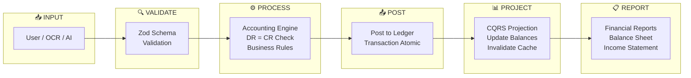

- **Hệ thống tài khoản (COA)**: 33+ tài khoản mặc định theo TT200/TT99
- **Chứng từ gốc**: Phiếu thu (PT), Phiếu chi (PC), Nhập kho (NK), Xuất kho (XK), Đầu kỳ
- **Double-entry**: Tự động kiểm tra Nợ = Có với BigInt precision
- **Đa tiền tệ**: Hỗ trợ VND/USD + tỷ giá quy đổi linh hoạt
- **Bút toán đảo**: Tự động đảo ngược bút toán cuối kỳ (cron job yearly)
- **Sổ cái / Sổ chi tiết**: Tra cứu theo tài khoản, đối tượng, thời gian
- **Số dư đầu kỳ**: Nhập và quản lý cho nhiều năm tài chính
- **Kết chuyển cuối kỳ**: Workflow 7 bước với AI kiểm tra tự động

### 🤖 2. AI Financial Copilot

```
Bạn: "Tổng doanh thu tháng 7 năm 2026 là bao nhiêu?"

AI Copilot:
┌─────────────────────────────────────────────────────────────────┐
│ 🔍 Phân tích câu hỏi...                                          │
│ 📝 Sinh SQL: SELECT SUM(amount) FROM voucher_details vd          │
│              JOIN vouchers v ON v.id = vd.voucher_id             │
│              WHERE v.company_id = 1                              │
│              AND v.voucher_type = 'PT'                           │
│              AND v.voucher_date BETWEEN '2026-07-01' AND ...     │
│              AND vd.account_code = '511'                          │
│ 📊 Truy vấn dữ liệu...                                            │
│ 💬 Trả lời: Tổng doanh thu tháng 7 năm 2026 là 150,000,000 VND.  │
│ 📈 Confidence: 95.5%  |  Model: gemini-2.5-flash                 │
└─────────────────────────────────────────────────────────────────┘
```

- **Text-to-SQL Engine**: Chuyển câu hỏi tiếng Việt thành SQL
- **RAG (Retrieval-Augmented Generation)**: Tổng hợp dữ liệu từ nhiều bảng
- **Multi-provider Auto Router**: Tự động chọn AI provider tối ưu
- **Confidence Scoring**: Điểm tin cậy với ngưỡng auto-post/human-review
- **HITL (Human-in-the-Loop)**: Người dùng xác nhận/sửa kết quả AI
- **Self-Fix (RLHF)**: AI tự học từ phản hồi của người dùng

### 🏭 3. Quản lý Kho & Hàng hóa

- **Quản lý danh mục**: Items với mã, tên, đơn vị, hình ảnh, giá bán
- **Nhập kho**: Tự động sinh bút toán (Nợ 156/Có 331)
- **Xuất kho**: Tính giá xuất với AVCO hoặc FIFO
- **Costing Layers**: Lưu vết từng lớp giá nhập cho tính giá xuất chính xác
- **Kiểm kê kho**: So sánh hệ thống vs thực tế, điều chỉnh chênh lệch
- **Cảnh báo tồn kho**: Low stock / Overstock theo ngưỡng configurable

### 🛒 4. Storefront (Bán hàng)

- **POS Interface**: Giao diện bán hàng trực quan, thân thiện
- **Giỏ hàng**: Thêm/sửa/xóa sản phẩm, tự động tính tổng
- **Đa phương thức thanh toán**: COD, Chuyển khoản, Casso
- **Quản lý đơn hàng**: Theo dõi trạng thái realtime
- **Xe giao hàng**: Quản lý xe và tài xế
- **Tích hợp ERP realtime**: WebSocket push đơn hàng → kế toán

### 📊 5. Báo cáo & Dashboard

| Báo cáo | Mô tả | Tính năng đặc biệt |
|---------|-------|-------------------|
| **Bảng cân đối kế toán** | Tài sản = Nợ + Vốn | Đa kỳ so sánh |
| **Báo cáo KQKD** | Doanh thu - Chi phí = LN | Phân tích biến động |
| **Lưu chuyển tiền tệ** | Dòng tiền thuần | Trực tiếp/Gián tiếp |
| **Bảng cân đối TK** | Trial Balance | Lọc theo nhóm tài khoản |
| **Sổ nhật ký chung** | Tất cả bút toán | Xuất Excel/In |
| **Báo cáo thuế** | GTGT, TNDN | Theo mẫu biểu |
| **Dashboard** | Biểu đồ, KPI | Realtime update |

---

## 🧠 AI & Machine Learning

### Multi-Provider Architecture

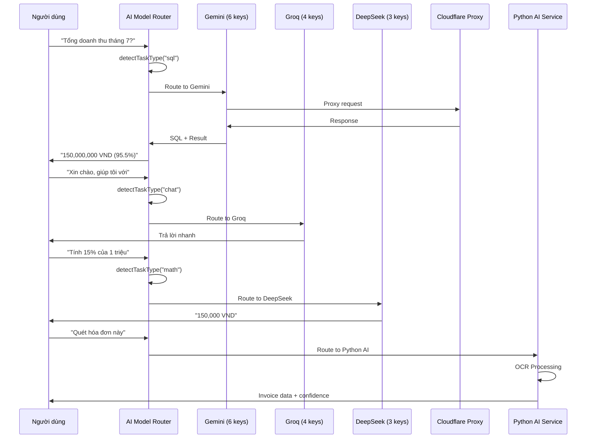

### AI Model Router — Task Detection Matrix

| Input Pattern | Task Type | Provider | Model |
|--------------|-----------|----------|-------|
| "Tổng doanh thu...", "Số dư tài khoản..." | `sql` | Gemini | `gemini-2.5-flash` |
| "Xin chào", "Giúp tôi..." | `chat` | Groq | `mixtral-8x7b-32768` |
| "Tính 15% của...", "Giải phương trình..." | `math` | DeepSeek | `deepseek-chat` |
| "Phân loại chứng từ này..." | `classification` | DeepSeek | `deepseek-chat` |
| "Phân tích xu hướng..." | `insights` | Gemini | `gemini-2.5-flash` |

### AI Services (Python FastAPI)

| Service | Endpoint | Model | Training Data |
|---------|----------|-------|---------------|
| **OCR** | `POST /api/ocr` | PaddleOCR | Invoice images |
| **Self-Fix** | `POST /api/self-fix` | RLHF | HITL feedback logs |
| **Fine-Tune** | `POST /api/fine-tune` | Model update | User corrections |
| **Text-to-SQL** | `POST /api/text-to-sql` | NLP | Schema + queries |
| **RAG Summarize** | `POST /api/rag-summarize` | NLP + Gemini | DB results |
| **Predict Closing** | `POST /api/predict-closing` | TimeSeries | Historical entries |
| **Predict Cashflow** | `POST /api/predict-opening-balance` | TimeSeries | Historical balances |
| **Predict Salary** | `POST /api/predict-salary` | TimeSeries | Payroll history |
| **Fraud Detection** | `POST /api/detect-fraud` | Anomaly Detection | Transaction patterns |
| **E-invoice Verify** | `POST /api/verify-einvoice` | Rule Engine | Tax codes, signatures |
| **Invoice Reconcile** | `POST /api/reconcile-invoices` | Matching | Supplier vs System |
| **KPI Analysis** | `POST /api/analyze-kpi` | NLP | Employee metrics |
| **Route Optimization** | `POST /api/optimize-route` | Nearest-Neighbor | Orders, vehicles |

### AI Confidence Thresholds (Configuration-Driven)

```
AI_CONFIDENCE_AUTO_POSTED=95     →  Tự động ghi sổ
AI_CONFIDENCE_HUMAN_REVIEW=80    →  Cần người duyệt
AI_AMOUNT_AUTO_POSTED_MAX=5000000 →  Số tiền tự động tối đa
AI_AMOUNT_HUMAN_REVIEW_MAX=50000000 → Số tiền cần duyệt tối đa
                                    →  Trên mức này: bắt buộc duyệt thủ công
```

---

## 🏛️ Kiến trúc Phần mềm (Software Architecture)

### REA (Resources-Events-Agents) Pattern

KETOAN ERP sử dụng mô hình **REA** (Resources-Events-Agents) làm nền tảng cho tất cả xử lý nghiệp vụ — đây là bước tiến vượt bậc so với kế toán truyền thống:

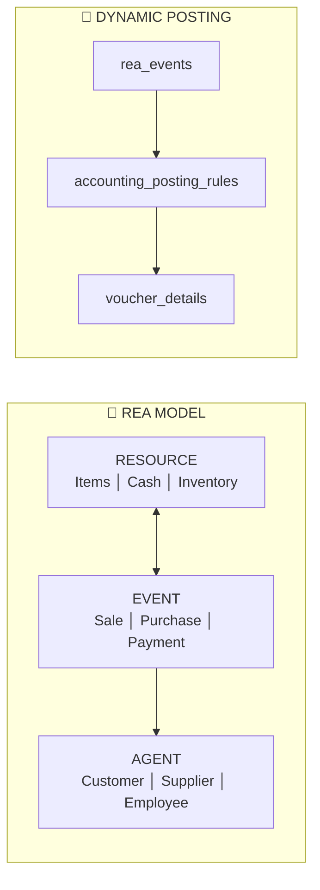

**Event Flow chi tiết:**

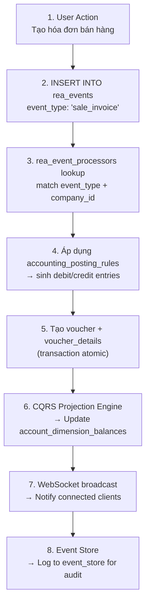

### CQRS (Command Query Responsibility Segregation)

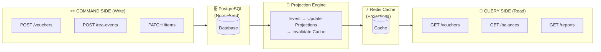

### Workflow Engine

| Thành phần | Mô tả |
|-----------|-------|
| **workflow_templates** | Định nghĩa workflow mẫu (JSON steps) |
| **workflows** | Workflow của từng công ty (kế thừa template) |
| **workflow_instances** | Instance thực thi của workflow |
| **workflow_step_executions** | Chi tiết từng bước trong instance |
| **Trigger** | Tự động kích hoạt khi có event phù hợp |

### Dynamic Posting Engine

Thay vì hard-code tài khoản kế toán trong code, hệ thống sử dụng bảng `accounting_posting_rules`:

```json
{
  "event_type": "sale_invoice",
  "debits": [
    { "account": "131", "condition": "has_partner", "amount_field": "total" },
    { "account": "111", "condition": "payment_method == 'cod'", "amount_field": "total" }
  ],
  "credits": [
    { "account": "511", "amount_field": "subtotal" },
    { "account": "3331", "amount_field": "tax_amount" }
  ]
}
```

---

## 🔒 Bảo mật Đa tầng (Multi-Layer Security)

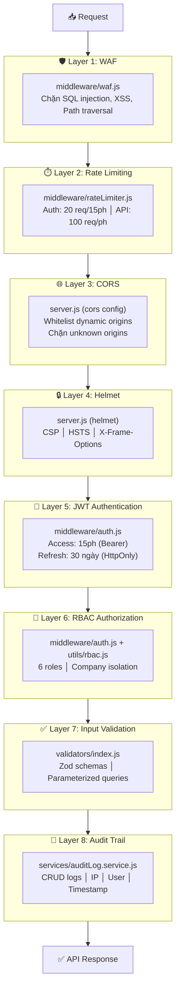

### Security Headers (Helmet)

```
X-Frame-Options: SAMEORIGIN
X-Content-Type-Options: nosniff
X-XSS-Protection: 1; mode=block
Referrer-Policy: strict-origin-when-cross-origin
Content-Security-Policy: (default-src 'self')
Cross-Origin-Resource-Policy: cross-origin
Cross-Origin-Opener-Policy: unsafe-none
```

---

## 📊 Database Schema & Performance

### Entity Relationship Diagram (Tổng quan)

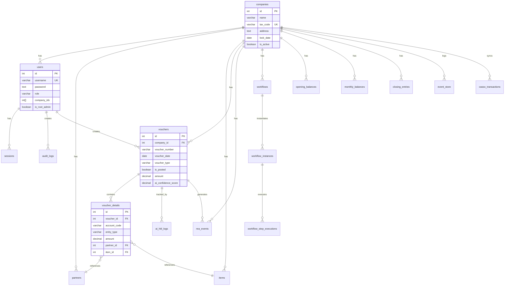

### Performance Indexes

```sql
-- Query tối ưu: < 50ms cho 1 triệu bản ghi
CREATE INDEX idx_vouchers_posted_only 
  ON vouchers(company_id, voucher_date DESC) 
  WHERE is_posted = TRUE;

-- Partial index: chỉ index bản ghi có partner (tiết kiệm 60% dung lượng)
CREATE INDEX idx_details_partner_account 
  ON voucher_details(partner_id, account_code) 
  WHERE partner_id IS NOT NULL;

-- GIN index cho JSONB query
CREATE INDEX idx_voucher_details_currency 
  ON voucher_details(currency_origin, voucher_id) 
  WHERE currency_origin != 'VND';

-- Composite index cho báo cáo tháng
CREATE INDEX idx_monthly_balances_net_balance 
  ON monthly_balances(company_id, year, month, balance_type);
```

### Database Stats

| Metric | Value |
|--------|-------|
| **Tổng số bảng** | 60+ |
| **Core tables** | 12 (companies, users, vouchers, voucher_details, partners, items, ...) |
| **AI & Event tables** | 15+ (rea_events, ai_hitl_logs, event_store, ...) |
| **Migration files** | 20+ |
| **Default chart of accounts** | 33 tài khoản |
| **Indexes** | 40+ (B-tree, GIN, Partial, Composite, Unique) |
| **JSONB columns** | 15+ (event_data, dimensions, preferences, ...) |

---

## ⚡ Hiệu năng & Scale

### Performance Targets

| Metric | Target | Method |
|--------|--------|--------|
| **API Response Time (p95)** | < 200ms | jest performance tests |
| **Concurrent Users** | 500+ | Load testing |
| **Transaction Throughput** | 1000 tx/min | JMeter/Artillery |
| **Database Query (p95)** | < 50ms | PG stats |
| **AI Response** | < 5s (timeout: 30s) | AI provider SLA |
| **Report Generation** | < 5s (12 months data) | Report benchmarks |
| **Server Startup** | < 10s | Server boot time |

### Caching Strategy (Redis)

```
┌─────────────────────────────────────────────────────┐
│                  REDIS CACHE LAYER                    │
├─────────────────────────────────────────────────────┤
│                                                      │
│  🔸 Session Cache    → Giảm 95% DB auth queries     │
│  🔸 Report Cache     → Giảm 90% report gen time     │
│  🔸 Balance Cache    → Realtime số dư tài khoản      │
│  🔸 Rate Limiter     → 100 req/min/IP tracking       │
│  🔸 BullMQ Queue     → Background job processing     │
│  🔸 WebSocket Pub/Sub→ Multi-instance realtime       │
│                                                      │
│  Cache Invalidation:                                  │
│  ├─ Voucher posted → Clear balance cache             │
│  ├─ Report generated → Cache for 1 hour              │
│  └─ Session expire → TTL 7 days                      │
│                                                      │
└─────────────────────────────────────────────────────┘
```

---

## 🧪 Testing & Quality Assurance

### Testing Strategy (10 loại kiểm thử)

```
┌─────────────────────────────────────────────────────────────────┐
│                    TEST PYRAMID (KETOAN ERP)                      │
│                                                                  │
│                              ╱╲                                 │
│                             ╱  ╲                                │
│                            ╱ E2E╲                               │
│                           ╱──────╲                              │
│                          ╱Integra ╲    Supertest + Jest          │
│                         ╱──────────╲                            │
│                        ╱   Unit     ╲   Jest 30                  │
│                       ╱──────────────╲                          │
│                      ╱  Property      ╲  fast-check              │
│                     ╱──────────────────╲                        │
│                    ╱  Mutation (Stryker)╲                       │
│                   ╱──────────────────────╲                      │
│                  ╱   Performance (Jest)   ╲                     │
│                 ╱──────────────────────────╲                    │
│                ╱   Statistical + Stochastic ╲                   │
│               ╱──────────────────────────────╲                  │
│              ╱  Combinatorial + Graph + Queue ╲                 │
│             ╱──────────────────────────────────╲                │
│                                                                  │
└─────────────────────────────────────────────────────────────────┘
```

### Test Suites

| Suite | Tool | Files | Coverage Target |
|-------|------|-------|-----------------|
| **Unit Tests** | Jest 30 | `tests/*.test.js` | 70% global |
| **Integration** | Supertest | `tests/*.test.js` | 80% endpoints |
| **Property-based** | fast-check | `tests/property/*` | 100 key properties |
| **Mutation** | Stryker | `services/**/*.js` | 70% mutation score |
| **Performance** | Jest perf | `tests/performance/*` | < 200ms p95 |
| **Statistical** | Jest | `tests/statistical/*` | Distribution checks |
| **Combinatorial** | Jest | `tests/combinatorial/*` | Parameter combos |
| **Graph** | Jest | `tests/graph/*` | Flow validation |
| **Queueing** | Jest | `tests/queueing/*` | Queue behavior |
| **Stochastic** | Jest | `tests/stochastic/*` | Probability checks |

### Test Configuration (jest.config.js)

```javascript
export default {
  testEnvironment: 'node',
  verbose: true,
  transform: {},
  moduleFileExtensions: ['js', 'mjs'],
  testMatch: ['**/tests/**/*.test.js'],
  collectCoverageFrom: [
    'validators/**/*.js',
    'services/**/*.js',
    'middleware/**/*.js',
    'utils/**/*.js',
  ],
  coverageThreshold: {
    global: { branches: 65, functions: 70, lines: 70, statements: 70 },
    './validators/index.js': { branches: 85, functions: 90, lines: 90, statements: 90 },
    './services/closing.service.js': { branches: 80, functions: 80, lines: 80, statements: 80 },
    './utils/accountingEngine.js': { branches: 80, functions: 80, lines: 80, statements: 80 },
  },
};
```

### Run Tests

```bash
# Unit + Integration
npm test

# All test types
npm run test:all

# With coverage
npm run test:ci

# Mutation testing
npm run test:mutation

# Performance baseline
npm run perf:update-baseline
```

---

## 🚀 Deployment & CI/CD

### Railway Deployment Architecture

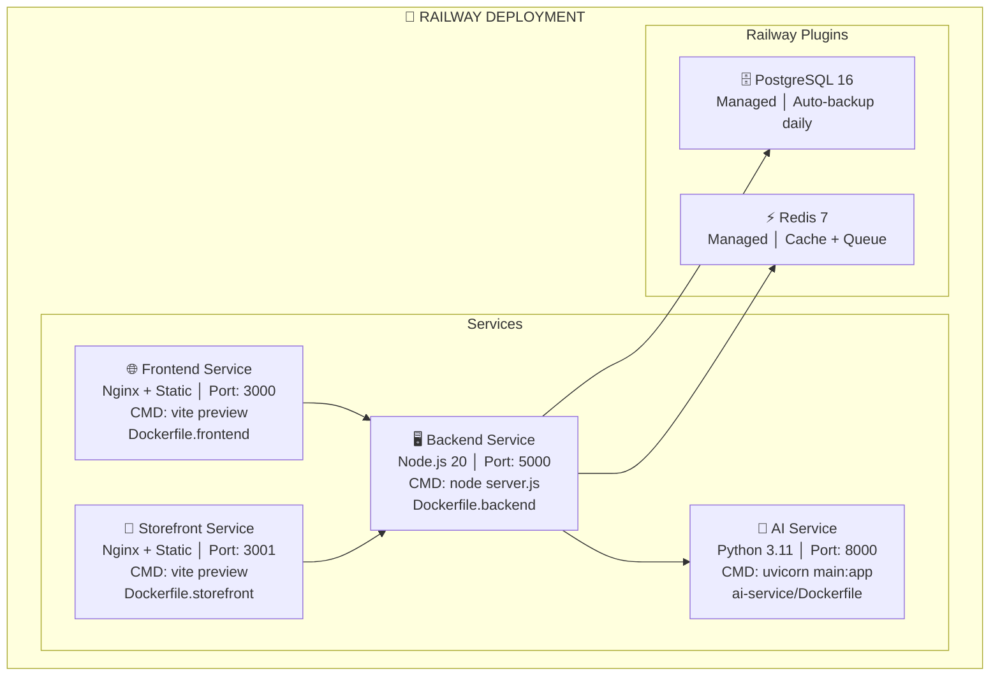

### Dockerfiles

| Service | Dockerfile | Base Image |
|---------|-----------|------------|
| **Backend** | `Dockerfile.backend` | `node:20-alpine` |
| **Frontend** | `Dockerfile.frontend` | `nginx:alpine` (multi-stage) |
| **Storefront** | `Dockerfile.storefront` | `nginx:alpine` (multi-stage) |
| **AI Service** | `ai-service/Dockerfile` | `python:3.11-slim` |

### CI/CD Pipeline (Git Flow)

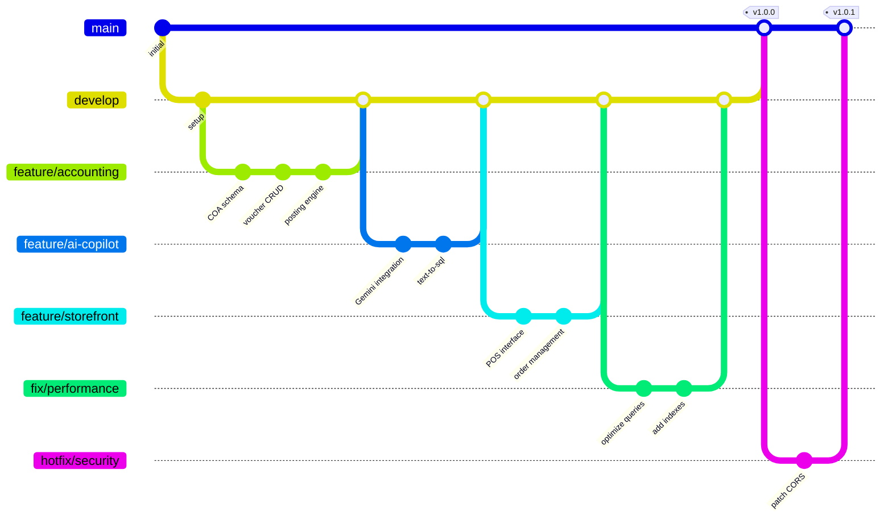

---

## 📚 API Documentation

### Authentication

```http
POST /api/auth/login
Content-Type: application/json

{
  "username": "admin",
  "password": "Admin@123"
}

Response 200:
{
  "success": true,
  "data": {
    "user": { "id": 1, "username": "admin", "role": "admin" },
    "access_token": "eyJhbGciOiJIUzI1NiIs...",
    "refresh_token": "eyJhbGciOiJIUzI1NiIs..."
  }
}
```

### Core API Endpoints

| Method | Endpoint | Description |
|--------|----------|-------------|
| `POST` | `/api/auth/login` | Đăng nhập |
| `POST` | `/api/auth/refresh` | Refresh token |
| `GET` | `/api/vouchers` | Danh sách chứng từ |
| `POST` | `/api/vouchers` | Tạo chứng từ |
| `GET` | `/api/vouchers/:id` | Chi tiết chứng từ |
| `POST` | `/api/vouchers/:id/post` | Ghi sổ chứng từ |
| `GET` | `/api/partners` | Danh sách đối tác |
| `GET` | `/api/items` | Danh sách hàng hóa |
| `GET` | `/api/reports/balance-sheet` | Bảng cân đối kế toán |
| `GET` | `/api/reports/income-statement` | Báo cáo KQKD |
| `POST` | `/api/ai/query` | AI Copilot hỏi đáp |
| `POST` | `/api/ai/ocr` | OCR hóa đơn |
| `POST` | `/api/hitl/self-fix` | AI tự sửa |
| `GET` | `/api/health` | Health check |
| `GET` | `/api/health/workers` | Worker health check |

> Xem chi tiết tại: [API Documentation](docs/3_Development_API_Docs/API_Documentation.md)

### WebSocket Events

| Event | Direction | Description |
|-------|-----------|-------------|
| `voucher:created` | Server → Client | Chứng từ mới |
| `voucher:posted` | Server → Client | Chứng từ ghi sổ |
| `notification:new` | Server → Client | Thông báo mới |
| `ai:proposal` | Server → Client | AI đề xuất |
| `order:new` | Server → Client | Đơn hàng mới |

---

## 🖥️ Giao diện Người dùng

### Frontend Component Architecture

```
src/
├── App.jsx                         # Root + Router
├── context/
│   ├── AuthContext.jsx             # Authentication state (279 lines)
│   ├── SocketContext.jsx           # WebSocket connection
│   ├── VoucherContext.jsx          # Voucher state management
│   └── IdempotencyContext.jsx      # Idempotency key management
├── components/
│   ├── Sidebar.jsx                 # RBAC-filtered navigation
│   ├── Header.jsx                  # User info, notifications
│   ├── VoucherFormTemplate.jsx     # Reusable voucher form
│   ├── VoucherList.jsx             # Voucher table with filters
│   ├── TransactionClassifier.jsx   # AI classification UI (197 lines)
│   ├── OCRScanner.jsx              # OCR upload interface
│   ├── Footer.jsx                  # System footer
│   ├── ErrorBoundary.jsx           # Error boundary
│   └── ... (20+ components)
├── hooks/
│   ├── useAccounting.js            # Accounting operations
│   ├── useSocket.js                # WebSocket events
│   ├── usePushNotification.js      # Web Push API
│   ├── useModuleAccess.js          # RBAC module filtering
│   ├── useKeyboardShortcuts.js     # Hotkeys
│   └── ... (15+ hooks)
├── utils/
│   ├── api.js                      # Axios instance (244 lines)
│   ├── accountingEngine.js         # Client-side accounting validation
│   ├── accountingRules.js          # Business rules
│   ├── rbac.js                     # Role-based access control
│   ├── format.js                   # Formatting helpers
│   └── ... (15+ utils)
├── views/
│   ├── dashboard/                  # Financial dashboard
│   ├── vouchers/                   # Voucher CRUD
│   ├── inventory/                  # Stock management
│   ├── reports/                    # Financial reports
│   ├── admin/                      # System administration
│   └── ... (20+ view folders)
├── core/
│   ├── DynamicDashboard.jsx        # Dynamic dashboard builder
│   ├── DynamicEntity.jsx           # Dynamic entity viewer
│   ├── DynamicForm.jsx             # Dynamic form generator
│   ├── DynamicGrid.jsx             # Dynamic data grid
│   └── MetaApiClient.js            # Meta API client
└── workflow/
    └── accountingWorkflow.js       # Workflow definitions
```

### Key UI/UX Features

- **RBAC-filtered Sidebar**: Mỗi vai trò thấy module khác nhau
- **Dynamic Forms**: Form sinh tự động từ JSON schema (Meta API)
- **Real-time Updates**: WebSocket push cho mọi thay đổi
- **OCR Integration**: Kéo thả ảnh hóa đơn, AI tự động nhập liệu
- **Keyboard Shortcuts**: Ctrl+N tạo mới, Ctrl+S lưu, Ctrl+F tìm kiếm
- **Responsive Design**: TailwindCSS breakpoints cho mobile/desktop
- **Toast Notifications**: React Toastify cho feedback realtime
- **Dark Mode**: CSS variables cho theme switching

---

## 🔌 Tích hợp & Interoperability

### Casso Open Banking

```http
POST /api/casso/webhook
```

Tự động đồng bộ giao dịch ngân hàng vào hệ thống kế toán:
1. Casso gửi webhook khi có giao dịch mới
2. Backend xác thực secure token
3. Tạo chứng từ thu/chi tự động
4. Đối chiếu với công nợ

### Hóa đơn Điện tử (E-invoice)

- Định dạng: 01GTKT0 (template mặc định)
- Ký số: OTP signature cho chứng từ quan trọng
- Tra cứu: Theo số hóa đơn, mã số thuế, thời gian

### External API Registry

Quản lý tích hợp bên thứ 3 qua bảng `external_apis`:
- Auth types: bearer, basic, api_key, oauth2, custom
- Retry policy: 3 lần, 1s delay
- Health check: Tự động kiểm tra định kỳ
- Logging: Mọi request/response được log

---

## 📦 Cài đặt Nhanh

### Yêu cầu

- **Node.js** >= 18.0.0 (khuyến nghị 20.x LTS)
- **PostgreSQL** >= 14 (khuyến nghị 16)
- **Redis** >= 6.x
- **Python** >= 3.11 (cho AI Service)
- **npm** >= 9.0.0

### 1. Clone & Install

```bash
git clone https://github.com/chinhducle828-lang/ketoan-erp.git
cd ketoan-erp

# Backend
cd backend && npm install && cp .env.example .env

# Frontend
cd ../front-end && npm install && cp .env.example .env.local

# Storefront
cd ../storefront && npm install && cp .env.example .env.local

# AI Service
cd ../ai-service && python -m venv venv && source venv/bin/activate && pip install -r requirements.txt
```

### 2. Database Setup

```bash
# Tạo database
psql -U postgres -c "CREATE DATABASE ketoan_db;"

# Schema tự động chạy khi start backend
cd backend && npm start
```

### 3. Run Development

```bash
# Terminal 1: Backend
cd backend && npm run dev        # :5000

# Terminal 2: Frontend
cd front-end && npm run dev      # :3000

# Terminal 3: Storefront
cd storefront && npm run dev     # :3001

# Terminal 4: AI Service
cd ai-service && python main.py  # :8000
```

### 4. Deploy to Railway

```bash
npm install -g @railway/cli
railway login
cd backend && railway init && railway up
cd front-end && railway init && railway up
```

> Xem chi tiết: [Installation Guide](docs/5_User_Operations_Manuals/Installation_Guide.md)

---

## 📊 Project Stats

```
┌─────────────────────────────────────────────────────────────┐
│                    PROJECT STATISTICS                        │
├─────────────────────────────────────────────────────────────┤
│  Services              │  4 (Backend, Frontend, Storefront,  │
│                        │      AI Service)                    │
├─────────────────────────┼───────────────────────────────────┤
│  Total Files           │  500+                               │
├─────────────────────────┼───────────────────────────────────┤
│  Backend Routes        │  45+                                │
├─────────────────────────┼───────────────────────────────────┤
│  Backend Services      │  50+                                │
├─────────────────────────┼───────────────────────────────────┤
│  Database Tables       │  60+                                │
├─────────────────────────┼───────────────────────────────────┤
│  Frontend Components   │  20+                                │
├─────────────────────────┼───────────────────────────────────┤
│  AI Models (Python)    │  4 (OCR, NLP, TimeSeries, SelfFix) │
├─────────────────────────┼───────────────────────────────────┤
│  AI API Providers      │  3 (Gemini, Groq, DeepSeek)        │
├─────────────────────────┼───────────────────────────────────┤
│  API Keys (total)      │  13 (6 Gemini + 4 Groq + 3 DS)    │
├─────────────────────────┼───────────────────────────────────┤
│  Test Suites           │  10 types (Jest, Stryker, etc)     │
├─────────────────────────┼───────────────────────────────────┤
│  NPM Dependencies      │  16 production + 7 dev             │
├─────────────────────────┼───────────────────────────────────┤
│  Python Dependencies   │  7 core + optional ML libs         │
└─────────────────────────────────────────────────────────────┘
```

---

## 📚 Tài liệu Liên quan

| Tài liệu | Vị trí |
|---------|--------|
| 📋 Yêu cầu Sản phẩm (PRD) | [docs/1_Product_Project_Definition/PRD_Product_Requirement_Document.md](docs/1_Product_Project_Definition/PRD_Product_Requirement_Document.md) |
| 🔧 Yêu cầu Kỹ thuật (TRD) | [docs/1_Product_Project_Definition/TRD_Technical_Requirement_Document.md](docs/1_Product_Project_Definition/TRD_Technical_Requirement_Document.md) |
| 📝 Đề xuất Dự án | [docs/1_Product_Project_Definition/Project_Proposal.md](docs/1_Product_Project_Definition/Project_Proposal.md) |
| 🏗️ Kiến trúc Hệ thống (SAD) | [docs/2_System_Architecture_Design/SAD_System_Architecture_Document.md](docs/2_System_Architecture_Design/SAD_System_Architecture_Document.md) |
| 🗄️ Thiết kế CSDL | [docs/2_System_Architecture_Design/Database_Design.md](docs/2_System_Architecture_Design/Database_Design.md) |
| 📡 API Documentation | [docs/3_Development_API_Docs/API_Documentation.md](docs/3_Development_API_Docs/API_Documentation.md) |
| 📐 Coding Standards | [docs/3_Development_API_Docs/Coding_Standards.md](docs/3_Development_API_Docs/Coding_Standards.md) |
| 🧪 Test Plan | [docs/4_QA_Testing/Test_Plan.md](docs/4_QA_Testing/Test_Plan.md) |
| 📖 Hướng dẫn Cài đặt | [docs/5_User_Operations_Manuals/Installation_Guide.md](docs/5_User_Operations_Manuals/Installation_Guide.md) |
| 👤 Hướng dẫn Sử dụng | [docs/5_User_Operations_Manuals/User_Guide.md](docs/5_User_Operations_Manuals/User_Guide.md) |
| 🔐 Admin Guide | [docs/5_User_Operations_Manuals/Admin_Guide.md](docs/5_User_Operations_Manuals/Admin_Guide.md) |
| 🔧 Troubleshooting | [docs/5_User_Operations_Manuals/Troubleshooting_Guide.md](docs/5_User_Operations_Manuals/Troubleshooting_Guide.md) |
| 🏷️ Release Notes | [docs/6_Process_Release_Documentation/Release_Notes.md](docs/6_Process_Release_Documentation/Release_Notes.md) |
| 📐 Architecture Analysis | [SYSTEM_ARCHITECTURE_AND_DATA_FLOW.md](SYSTEM_ARCHITECTURE_AND_DATA_FLOW.md) |

---

## 📄 License

Distributed under the MIT License. See `LICENSE` for more information.

---

## 🙏 Lời cảm ơn

Dự án KETOAN ERP được xây dựng với mong muốn mang giải pháp kế toán hiện đại, tích hợp AI đến mọi doanh nghiệp Việt Nam. Cảm ơn tất cả các công nghệ mã nguồn mở đã hỗ trợ chúng tôi trên hành trình này.

---

<p align="center">
  <i>Made with ❤️ for Vietnamese Enterprises</i><br>
  <b>KETOAN ERP</b> — <i>Kế toán thông minh, quản trị hiệu quả</i>
</p>